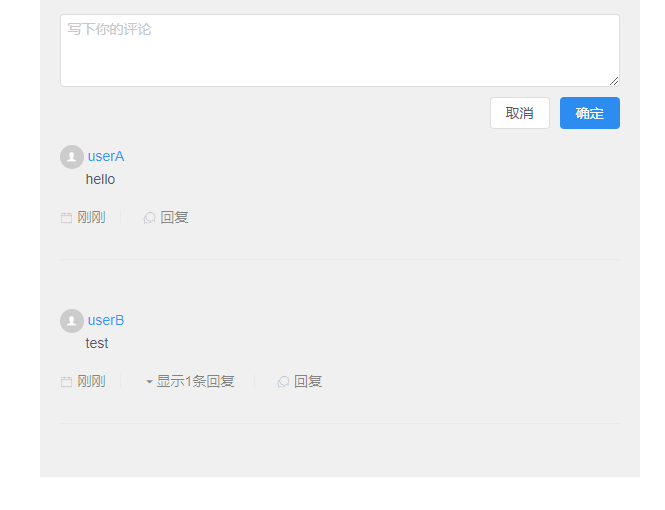

## 安装

```bash
npm install iview-comment-tree
```

## 使用

```js
//main.js
import ViewUI from "view-design";
import IViewCommentTree from "../index";
Vue.use(ViewUI);
Vue.use(IViewCommentTree);
```

或

```html
<template>
  <div id="app">
    <iview-comment-tree
      class="middle"
      :comments="comments"
      @on-comment="reply"
    />
  </div>
</template>

<script>
import IviewCommentTree from "iview-comment-tree";

export default {
  name: "App",
  components: {
    IviewCommentTree
  },
}
</script>
```



## Props

| 属性               | 描述            | 类型     | 接受值                           | 默认值         |
| ------------------ | --------------- | -------- | -------------------------------- | -------------- |
| pageSize           | 每页评论数      | Number   | 正整数                           | 10             |
| defaultPlaceholder | 默认placeholder | String   | -                                | "写下你的评论" |
| RenderTime         | 时间渲染函数    | Function | 参数为Date，返回值为字符串的函数 | 默认渲染函数   |
| comments           | 评论数组树      | Array    | 见comment                        | 演示默认值     |

### comments

| 属性          | 描述       | 类型   | 接受值         |
| ------------- | ---------- | ------ | -------------- |
| username      | 用户名     | String | -              |
| content       | 评论内容   | String | -              |
| CreateTime    | 日期       | Date   | -              |
| ReplyComments | 评论数组树 | Array  | comments，可空 |

## event

| 事件名     | 说明             | 返回值                                                    |
| ---------- | ---------------- | --------------------------------------------------------- |
| on-comment | 回复评论后的事件 | {content:评论内容,reply:所回复的评论的引用，若无则为null} |

## 示例

查看`src/examples`
